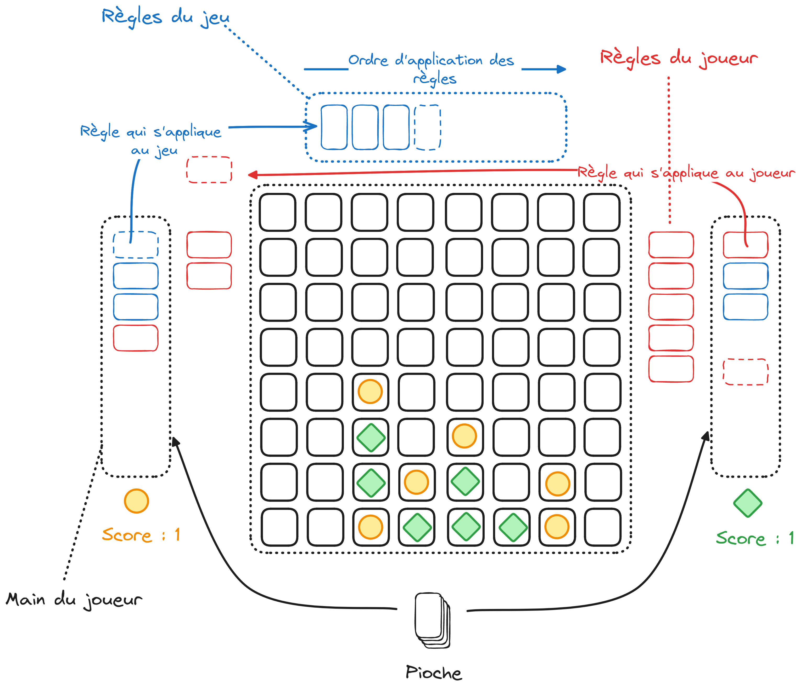

# 8T

8T is a board game that reinvents the traditional tic-tac-toe by introducing new rules, transforming the gaming experience. Initially played on a 3x3 board where players alternate between placing a circle and a cross in order to align three of their pieces, the game quickly becomes more complex. When the board reaches a deadlock and no player can win, each player chooses a new rule, drawn at random, to spice up the game, such as increasing the size of the board, activating gravity, changing the color of a piece, or destroying the aligned pieces... The aim is no longer to win once by aligning the pieces, but to win as many times as possible, until one of the players decides to play the "game over in 10 turns" rule.

## Interface

## Build

~~~bash
mkdir build
cd build
cmake ..
make
cd ../bin
./graphic
~~~